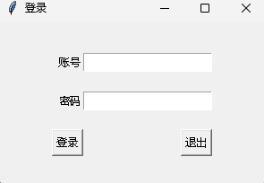
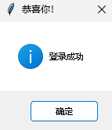
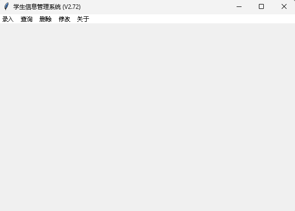
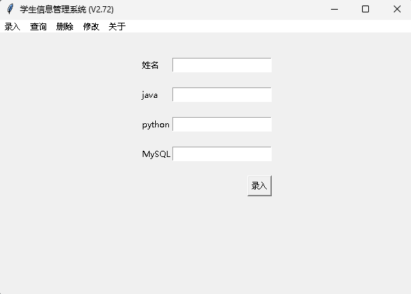
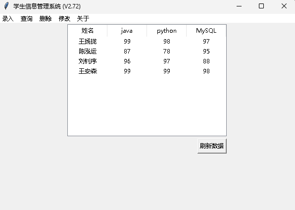
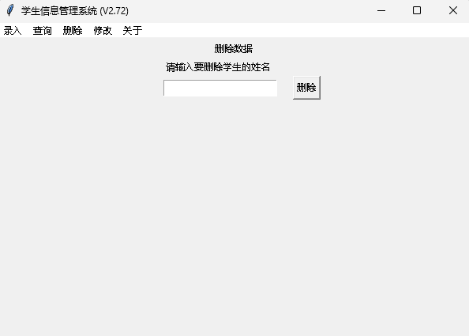
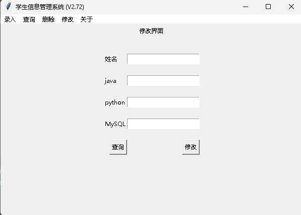
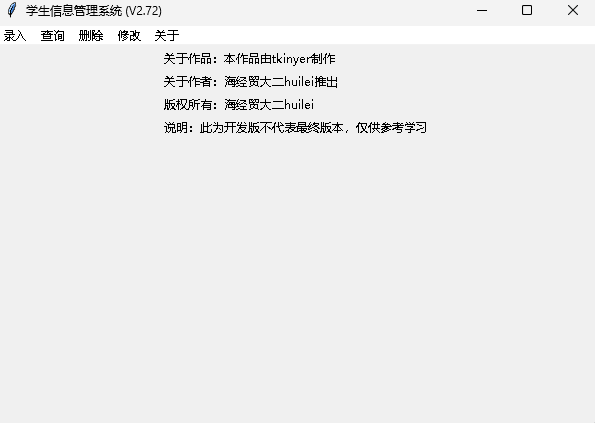

# pyStudentSystem

## 介绍
本仓库存放的是python的学生管理系统，由海经贸大二学生开发，目前尚未完善，项目仍在完善中。。。
纯python项目，仅供学习参考。

## 软件简单展示
### 1.1登录界面

### 1.2登录成功

### 2.0主界面

### 2.1 录入界面
 

### 2.2 查询界面

### 2.3 删除界面

### 2.4 修改界面

### 2.5 关于界面

### 3 更多：想啥呢傻孩子， 还不抓紧下载体验一下，

## 使用说明

1.  下载python11.0版本
2.  打开本项目地址，复制链接，下载到本地
3.  右键app.py,运行项目
4.  默认账号和密码：
~~~python
admin
~~~
当然，你也可以在login文件下更改大概在第28行

## 参与贡献
 ##### 1.根据b站大佬视频编写，学习地址https://www.bilibili.com/video/BV1Bu41177P7/?spm_id_from=333.1007.top_right_bar_window_custom_collection.content.click

